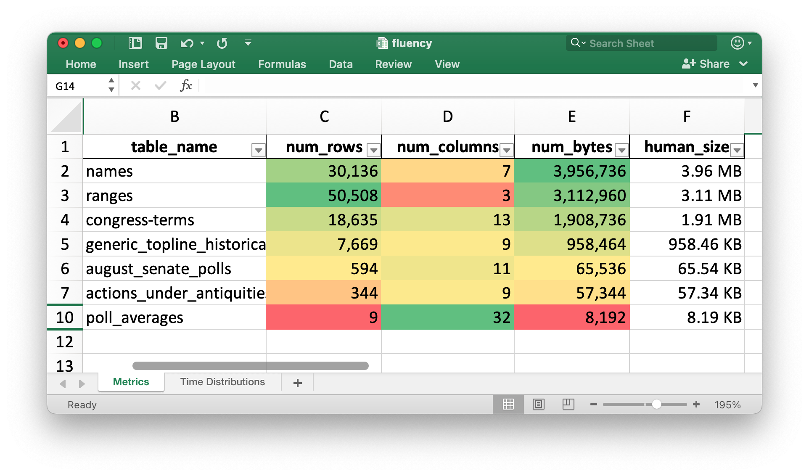
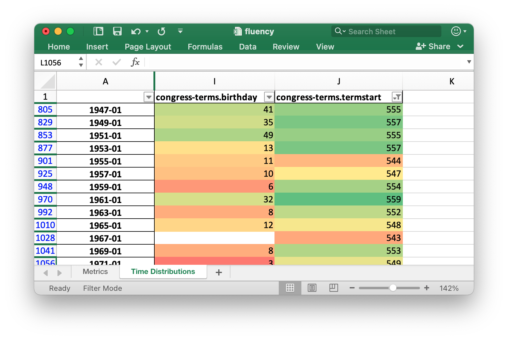

# Data Fluent for PostgreSQL

Build a better understanding of your data in PostgreSQL.





## Installation

On Ubuntu 20:

```
$ wget -qO- \
    https://www.postgresql.org/media/keys/ACCC4CF8.asc \
        | sudo apt-key add -
$ echo "deb http://apt.postgresql.org/pub/repos/apt/ xenial-pgdg main" \
    | sudo tee /etc/apt/sources.list.d/pgdg.list

$ sudo apt update
$ sudo apt install git \
                 python3-pip \
                 python3-virtualenv \
                 postgresql-13 \
                 postgresql-client-13 \
                 postgresql-contrib
```

On macOS:

```
$ brew install \
    git \
    postgresql \
    virtualenv
```

```
$ virtualenv ~/.fluency
$ source ~/.fluency/bin/activate
$ python3 -m pip install \
    csvkit \
    humanfriendly \
    ipython \
    openpyxl \
    Pandas \
    psycopg2-binary \
    typer \
    xlsxwriter
```

### Example Analysis

Clone fivethirtyeight's data repo. It has a large number of CSV-formatted datasets.

```bash
$ git clone https://github.com/fivethirtyeight/data.git ~/538data
```

Make sure you can access a PostgreSQL database on your machine. Here I'm creating an 'intel' database for the 'mark' user on my Ubuntu 20 machine.

```bash
$ sudo -u postgres \
    bash -c "psql -c \"CREATE USER mark
                       WITH PASSWORD 'test'
                       SUPERUSER;\""
$ createdb intel
```

I'll import one of the datasets within fivethirtyeight's repo. Note, because the dates within this dataset are not formatted in YYYY-MM-DD format, I needed to override the format so that the MM/DD/YYYY format would be read properly.

```bash
$ csvsql --db postgresql:///intel \
         --insert ~/538data/congress-generic-ballot/generic_topline_historical.csv \
         --datetime-format="%m/%d/%Y"
```

I'll run the Excel Report Generator:


```bash
$ python datafluent_pg.py
```

This will result in a ```fluency.xlsx``` file being produced with two worksheets: "Metrics" and "Time Distributions".

If you need to override any parameters, please refer to the documentation:

```bash
$ python datafluent_pg.py --help
```

```
Usage: datafluent_pg.py [OPTIONS]

Options:
  --pg-dns TEXT                   [default: postgresql://localhost:5432/intel]
  --output TEXT                   [default: fluency.xlsx]
  --install-completion [bash|zsh|fish|powershell|pwsh]
                                  Install completion for the specified shell.
  --show-completion [bash|zsh|fish|powershell|pwsh]
                                  Show completion for the specified shell, to
                                  copy it or customize the installation.

  --help                          Show this message and exit.
```